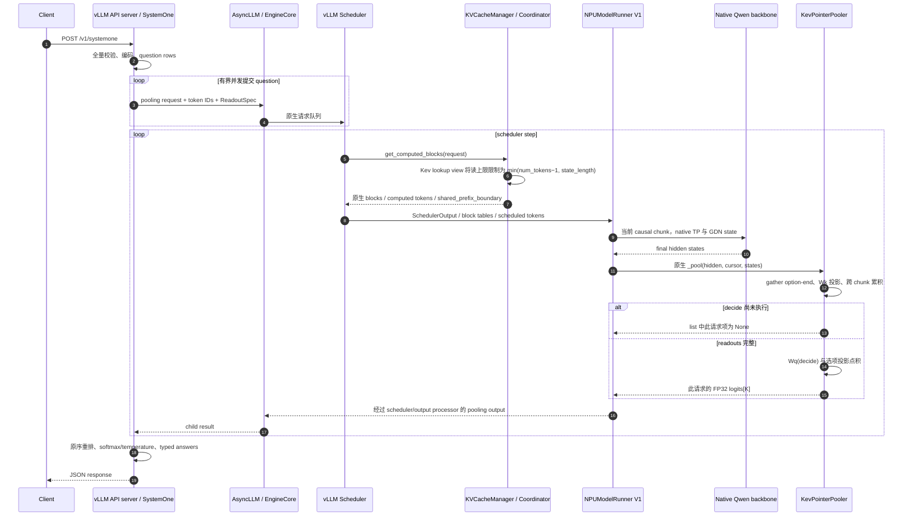

# vLLM-Ascend 原生 Kev 决策引擎：设计与实现

日期：2026-09-23。本文对应 `codex/kev-native-engine` 分支，替代此前以 Kev 仓库扩展包为交付主体的方案。

## 1. 集成边界

用户部署的是 **vLLM-Ascend**：安装本仓库、准备 Kev checkpoint，然后执行普通 `vllm serve`。模型发现、API 服务、EngineCore、调度器、executor、NPU workers、TP/DP 和缓存管理均复用 vLLM/vLLM-Ascend。

Kev 在这里是一种 **原生注册的 pooling 模型能力**。HTTP 层只负责协议转换与结果聚合；backbone 和 pointer head 都在模型 worker 中运行。没有独立 Kev 推理进程，不启动 `kev.serve`，不安装或 import `kev` / `vllm_kev`，不通过 HTTP 代理调用另一个推理服务。

原始 Kev 仓库仅作为 checkpoint 和输入输出语义的来源。编码与协议实现按 Apache-2.0 引入本仓库，并标注来源。此前 Kev 仓库的 `e0181d8` 保留作为历史原型；本方案不使用该提交的扩展包。

### 1.1 交付位置

| 所属层 | 实现位置 | 职责 |
|---|---|---|
| 安装入口 | `setup.py` | 注册 SystemOne endpoint、离线导出命令和导出依赖 extra |
| 模型发现 | `vllm_ascend/models/__init__.py` | 通过现有 `ascend_model` 插件注册三个 Kev architecture |
| 模型适配 | `vllm_ascend/patch/worker/patch_kev.py` | 组合 native Qwen backbone，接入 head、权重 loader 和 hybrid state 接口 |
| 协议入口 | `vllm_ascend/entrypoints/systemone/` | TypeSafe 类 schema、父请求、原生批量提交与取消、答案转换 |
| 编码与配置 | `vllm_ascend/decision/` | 无 Kev 包依赖的编码、row planner、readout metadata 和导出器 |
| 推理算子 | `vllm_ascend/ops/kev_pointer.py` | FP32 pointer projection、跨 chunk 累积、变长 logits |
| 缓存适配 | `vllm_ascend/patch/platform/patch_kev.py` | 查询前限制前缀读取长度、Kev hybrid pooling capability |
| NPU runner | `vllm_ascend/worker/model_runner_v1.py` | 保留现有 `_pool` 执行，仅增加显式 dummy profiling 入口 |

没有复制 Transformer decoder 或 GDN 内核，没有建立另一套 scheduler。模型相关适配放在 worker patch 中，保持 Ascend 的硬件插件边界。

### 1.2 对应源码快照

- vLLM：`6e448d0ea9bf3d88d898b65449ca6dc2aec170ac`。
- vLLM-Ascend 实现基线：`f74808abebac0a27ac945be16240fbeb6851415d`。
- Kev 原始语义基线：`f0be722ea246b7611716b232e0d84acc3cf20006`。

本地 vLLM 快照包含 endpoint plugin 与三返回值的 cache lookup 接口；代码不是针对所有历史 vLLM release 的兼容层。两仓库和 torch_npu/CANN 的版本需配套。

## 2. 请求粒度与数学语义

一个 SystemOne 父请求可以包含多个 question。每个 question 成为一个独立 vLLM pooling 请求：

```text
row_q = <state> state + <q> instructions
        + <opt> option_0 </opt> + ... + <opt> option_K </opt> + <decide>
```

所有 row 保持普通 causal 位置与掩码。不同 question 独立，同一 question 内 options 保留训练时的前后依赖。

```text
query = Wq * h_decide + bq
keys[i] = Wk * h_option_end[i] + bk
logits[i] = dot(keys[i], query) / sqrt(head_dim)
```

不能把“每个 option 只带自身内容”当成独立请求再 softmax：这会改变 option hidden 和 decide hidden。截断至各 option-end 的完整因果前缀可以保持 readout 语义，但需要 K+1 次请求，本实现不采用。

实际 delimiter 仍使用原有五个 Qwen token；用户文本中的控制 token 字符串先转义，不加入 chat template。`option_isolation=True` checkpoint 不支持，导出时拒绝。

内部 `ReadoutSpec` 使用 schema version 2，包含 `state_length`、`option_ends` 和 `decide`。offset 都是对应 row 内的绝对位置，不使用原 packed 序列的跨 question 索引。spec 经 planner 校验，再由 worker/cache adapter 检查。

## 3. 部署和模型加载

### 3.1 原生 architecture

注册以下 architecture：

- `AscendKevQwen2ForDecision`：Qwen2/Qwen2.5 dense。
- `AscendKevQwen3ForDecision`：Qwen3 dense。
- `AscendKevQwen35ForDecision`：Qwen3.5 非 MoE 文本模型，采用 GDN 与 full attention 混合结构。dense（非 MoE）与 hybrid（注意力结构）是两个独立维度。

wrapper 显式声明 `is_pooling_model=True`、`default_seq_pooling_type=LAST`，hybrid wrapper 显式声明 `attn_type=hybrid`，并提供原生 GDN state shape/dtype/copy 接口。构造函数显式接受 `vllm_config` 与 `prefix`，满足 vLLM `initialize_model` 的签名检查。

backbone 分别使用上游 `Qwen2Model`、`Qwen3Model`、`Qwen3_5Model`。Ascend 的现有 Qwen/GDN patch 与 custom operators 对这些 native 类生效。wrapper 不创建 vocabulary LM head，也不运行 sampler 或 speculative decoder。

### 3.2 checkpoint 准备

离线导出器属于 vLLM-Ascend，读取原始 `head.pt`、LoRA adapter 和 base 权重。FP32 合并 adapter 后将 backbone 转为目标 dtype，head 保持 FP32；输出 safetensors、tokenizer、native `config.json` 和哈希 manifest。

权重命名：`model.*` 为 native backbone，`pooler.q/k.weight/bias` 为 head。native loader 继续完成 QKV、gate/up、GDN qkv/z、b/a 融合及 TP 分片。模型加载检查所有 head 参数确实被加载且仍为 FP32。

当前导出器拒绝 MoE、需要保持 unmerged 的 BF16-trained checkpoint、特殊 trainable embedding、modules_to_save 和 option isolation。LoRA scale 固定 1；不读取 Kev 服务的环境变量。temperature、长度策略和 date_facts 存入 checkpoint 配置。

manifest 用于追溯输入和输出文件；目前不会在每次 vLLM 启动时重新计算整个模型的哈希。

## 4. 完整调用时序



API 进程里没有模型 forward、HF KV cache 或显存模型副本。CPU 层处理最多 255 个 logits 的归一化和结果格式。

## 5. 调度和生命周期

vLLM scheduler 看到的是普通 pooling 子请求，因而直接获得 token budget、跨父请求 batching、waiting/running 队列、chunked prefill 和抢占。父请求不是 scheduler 的原子大 batch，不必同时占据 Q 个 slot。

服务层仅负责协议转换、question rows 和结果聚合，不另设HTTP接入容量、父请求token总预算、question数量上限、提交并发上限或默认120秒deadline。每道question通过原生 `engine.encode()` 提交，全部generator使用原生 `merge_async_iterators()` 收集，与native pooling的批量请求路径一致。

HTTP路由复用 `validate_json_request`、`with_cancellation` 与 `load_aware_call`。断连监听、负载统计和JSON请求验证沿用原生实现，不再轮询 `is_disconnected()` 或构造499响应。Engine请求ID、DP路由、abort及collector生命周期由 `encode()` 管理；没有自定义 `add_request(data_parallel_rank=...)` 适配。父请求结果按输入question顺序聚合，不填补缺失结果。

编码规划和答案格式化使用renderer的共享executor；支持原生 `priority`、`cache_salt` 字段，沿用 `X-Request-Id` 及trace headers。模型名校验遵循 `VLLM_SKIP_MODEL_NAME_VALIDATION`；校验/引擎异常交由API server既有异常处理器处理。

`latency_ms` 包含计划、排队、执行和聚合。`usage.input_tokens` 保持逻辑口径：state 一次加所有 branch；物理调度 tokens 在无缓存时重复 state。`output_tokens` 仍是序列化答案的 token 数，不是生成量。

## 6. 前缀缓存：本次实现的核心差异

本次已加入实际 bounded APC 查询适配，而不是仅将前缀缓存列为未来工作。

### 6.1 限制发生在查找之前

当前 upstream `KVCacheManager.get_computed_blocks` 固定使用 `request.num_tokens - 1` 作为 lookup 上限。缓存全部 options 会跳过 pointer 必需的 hidden states，因此 Kev 上限必须不超过 `state_length`。

平台 patch 对 Kev 请求构造只读 `_PrefixLookupView`：

```text
lookup_view.num_tokens = min(original.num_tokens, state_length + 1)
其余属性转发 original Request
原生 get_computed_blocks(lookup_view)
```

由此原生 coordinator 收到的上限恰为 `min(original.num_tokens−1, state_length)`。**原始 Request、prompt_token_ids、block_hashes、调度进度都没有修改。** 这个 view 仅存活于同步缓存查询调用，不被放进 scheduler 队列。

这样避免复制 vLLM 的 eviction、cache-event 和 hybrid 协商代码，也避免先命中深层 hybrid state 再裁剪到不存在快照的位置。返回值再次检查 num_computed_tokens 和 shared_prefix_boundary 都不越过上限。

这个适配依赖上述本地快照的 lookup 契约。upstream 若新增正式 `max_prefix_read_tokens` 参数，应替换 lookup view；若 lookup 改为从其他字段计算长度，必须更新该适配。

patch 安装由 `ascend_model` general plugin 的 `register_model()` 和平台 patch 初始化两条路径触发，并带幂等守卫。当前 `EngineArgs` 初始化和 `AsyncEngineArgs.add_cli_args()` 均提前调用 `load_general_plugins()`，模型检查子进程也有加载入口；这是标准启动路径的静态证据。仍需对 serve、offline LLM 和 EngineCore 子进程做启动冒烟，确认 capability patch 在配置校验前生效。导入顺序可在具备依赖的环境中检查，不必与 NPU 数值验证绑定；若 patch 未安装，hybrid APC 可能在配置阶段被拒绝。

### 6.2 保留现有缓存所有权

物理 KV block 分配、引用计数、缓存登记、LRU/eviction、hybrid 各组公共可恢复边界均由原生 manager/coordinator 执行。可以缓存完整 question 的 blocks，但 Kev 读取时只消费 state 范围。

cache_salt、LoRA/model namespace 等既有 hash 行为不变。API 不往 salt 中塞 parent ID，否则会破坏跨父请求复用。同一首次到达的多个 cold siblings 不保证只算一次 state；首次预填尚未完成时它们仍可能重复计算。

KV connector/远端回填暂不开放：既在配置上拒绝，也在 connector lookup 中拒绝 Kev 请求，以免绕过 read limit。

### 6.3 Qwen3.5 hybrid

仅对原生 Kev architecture 放开 hybrid pooling 的 APC capability。配置必须使用 `mamba_cache_mode=align` 和 chunked prefill；未开启 hybrid APC 时使用 `none`。

attention KV 与 conv/recurrent state 的恢复和私有 continuation 仍走 Ascend 原生 GDN 实现。普通 prefill forward 内写回 recurrent state，不补调用 speculative-decoding 专用的 `postprocess_mamba_align_gpu`。

这里是**已编写的实现路径，不是硬件验证通过的结论**。首次 NPU 联调仍须重点检查：state 长度非 block 对齐、cache eviction、partial group hit、最后一个 pooling chunk 发布，以及 siblings 独立的 recurrent state。

## 7. 跨 chunk 的 pointer readout

每个 request 的 pooling state 保存 `end`、readout spec 和已见 option 的 FP32 低维投影。仅在该 chunk 覆盖边界时 gather/projection，不保存完整 prompt hidden。

```text
end = cursor.seq_lens_cpu[r]
start = end - cursor.num_scheduled_tokens_cpu[r]
local_index = option_end - start
flat_index = 当前请求在本 step hidden 中的起点 + local_index
```

完成 chunk 执行 decide projection，与全部 option projections 点积，返回 `list[Tensor[K] | None]`。未完成项是 None，缺少必要 option 的完成请求直接报错，避免永远等待。

### 7.1 抢占后重算

bounded APC 保证新请求或全量重算的恢复点不超过 `state_length`。在 `start <= state_length` 区间重建 accumulator 是安全的，因为尚无需要保留的 option readout；超出 state 的正常连续 chunk 必须满足 `old.end == start`。

这既支持从 0 重算，也支持从 cached state prefix 重算。暂时未调度的请求保留 accumulator，不在所有 InputBatch remove 上无条件清理。完成时显式删除；abort 后随原生 request state 的释放回收。

### 7.2 profiling

`NPUModelRunner._dummy_pooler_run_task` 显式识别 `KevPointerPooler` 并调用其 profile 方法。真实缺失 spec 不会被误判为 dummy。profile 包含每请求最多 255 个 pointer projection 的内存分配，为原生内存规划提供开销信息。

没有修改 GPU runner 的全局方法，没有通过 ContextVar 影响其他设备。非 Kev pooler 仍调用原方法。

## 8. 多卡部署

### 8.1 TP

原生 Qwen linear、attention、GDN 权重按 vLLM TP 规则切分。head 采用复制的 FP32 小矩阵，不在 pooler 中发起跨 TP rank collective，避免只有输出 rank 参与时死锁。当前不开放 sequence/context parallel，因此 readout 使用 runner 给出的完整 hidden 维度。

### 8.2 DP

DP使用原生 `EngineClient.encode()` 的负载均衡和部署路由。移除按state hash选择replica的逻辑，不向 `add_request` 指定DP rank；旧checkpoint中的 `dp_affinity` 字段忽略，导出器移除对应开关。同state请求不再保证落到同一个副本，其缓存复用取决于原生路由与各副本的本地缓存。不能为追求命中率覆盖部署的负载均衡行为。

### 8.3 当前边界

本次实现 V1 runner、eager、同步 scheduling 的 TP/DP 路径。V2 的 plugin task、PP 输出组合、图模式、PCP/DCP、动态 LoRA、量化、MoE/EP 和 KV transfer 仍明确拒绝。这里的“同步 scheduling”不等于 HTTP 串行：多个父子请求照常异步提交、由 vLLM 连续批处理。

## 9. 推理内核适配

Transformer、RoPE、paged attention、MLP、GDN conv/chunk/recurrent 内核全部复用现有实现。question row 是标准 causal 序列，故无需引入二维 Kev block mask 或自写分支 attention kernel。

新增的 `ops/kev_pointer.py` 在 NPU 上使用 gather、FP32 Linear、stack 与 dot。CPU 只根据已有 cursor/offset 生成索引，不对每个 NPU token/option 调用 `.item()`。结果沿原生 pooling 输出路径拷贝到 CPU。

当前不新增 AscendC kernel；批量 gather、ragged dot 融合和异步 D2H 是否值得做，取决于后续 profiler。hybrid fused CANN state 的 BF16 转换与 Triton state 精度路径应分开测，不宣称两者全链同精度。

## 10. 安装、导出与启动

### 10.1 安装

在匹配上述 vLLM 源码的 Ascend/CANN/torch_npu 环境中按仓库方式安装修改后的 vLLM-Ascend。必须重新安装 Python 包元数据，使新增 entry points 生效。

导出 checkpoint 时额外需要 PEFT 和兼容 Transformers，可使用本包 `kev-export` extra；在线服务不 import PEFT。

```bash
cd /opt/zsy/vllm-ascend
uv pip install -e '.[kev-export]'

vllm-ascend-export-kev \
  --run /models/kev-run \
  --base /models/Qwen3-4B-Base \
  --out /models/ascend-kev-qwen3 \
  --dtype bf16 --max-context 16384
```

`--run` 也支持 Hub ID[@revision]。输出目录必须不存在。导出需要足够的 CPU 内存进行 FP32 merge。导出时使用原生 architecture 与 schema 2；不要直接用旧 `vllm_kev` 原型的导出配置启动。

`--max-context` 默认 16384，表示每条 state + question branch 的服务长度上限，不从训练 run 自动推断。导出 manifest 的 `max_context_provenance` 记录数值、来源（显式 `cli` 或 `exporter_default`）和 `verified_against_training_run=false`。部署者应核对训练设置与目标上下文长度；该记录不表示已验证训练或模型位置上限。在线实际限制为 `min(kev_config.max_context, max_model_len)`，endpoint 初始化日志会显示该值。

### 10.2 attention-only：缓存 + TP2 + DP2

必须显式设置 `VLLM_PLUGINS` 并包含 `ascend_systemone`；endpoint plugins 与 general plugins 的默认加载规则不同，未设置该变量时不会加载 endpoint。遗漏时 vLLM 可能正常启动，但 `/v1/systemone` 返回 404。自定义 allowlist 时也需保留模型注册所需的 `ascend_model` 等 Ascend 插件。此规则只针对 HTTP 路由，offline LLM 不要求加载 endpoint。

下面示例占用四张 NPU。只验证单卡时将 TP/DP/local DP 都设为 1。启动后检查日志中的 `Kev endpoint /v1/systemone initialized`，并发送 §10.4 的请求确认路由和模型服务可用。

```bash
export VLLM_USE_V2_MODEL_RUNNER=0
export VLLM_PLUGINS=ascend,ascend_model,ascend_model_loader,ascend_kv_connector,ascend_service_profiling,ascend_systemone

vllm serve /models/ascend-kev-qwen3 \
  --served-model-name kev-latest \
  --runner pooling --pooler-config '{"task":"plugin"}' \
  --dtype bfloat16 --enforce-eager --no-async-scheduling \
  --enable-prefix-caching --enable-chunked-prefill --mamba-cache-mode none \
  --tensor-parallel-size 2 --data-parallel-size 2 --data-parallel-size-local 2 \
  --max-model-len 16384 --max-num-batched-tokens 4096 --max-num-seqs 64 \
  --port 8009
```

### 10.3 Qwen3.5 hybrid

使用 Qwen3.5 base 导出对应 checkpoint 后，沿用上述命令，将模型目录替换，并将 `--mamba-cache-mode none` 改为 `--mamba-cache-mode align`。

首次硬件联调可以先使用 `--no-enable-prefix-caching --mamba-cache-mode none`，对齐原始 Kev，再打开 hybrid APC。不能同时使用 APC 和不满足 align 约束的模式。

### 10.4 请求

```bash
curl http://127.0.0.1:8009/v1/systemone \
  -H 'Content-Type: application/json' \
  -d '{"model":"kev-latest","state":"I was charged twice.","questions":{"team":{"type":"choice","instructions":"Route this ticket","criteria":{"billing":"Payments and refunds","shipping":"Delivery"}},"payment":{"type":"noul","instructions":"Is this about a payment?"}}}'
```

同一个 vLLM server 提供 `/v1/models`。SystemOne 只在 Kev 模型配置下初始化；加载其他 plugin pooling 模型时，不会强制初始化 Kev 服务。原 Kev playground、permute/separate endpoints 不在此实现范围。

## 11. 语义、错误与限制

- Noul 固定 `[no, yes]`，返回 yes 概率。
- Choice 使用未四舍五入概率选 argmax，保留输入选项顺序。
- Score 返回有序 level 的期望；confidence 保持 Kev 近似公式。
- temperature 沿用 softmax 后 clamp 再幂次归一化；不是文字生成采样 temperature。
- 非 strict 模式会截断过长 state；strict-length 模式会拒绝过长 state。两种模式下，state 加 question branch 超过有效上下文上限都会报错，不会截断 branch。因此 max_context 配错既可能改变截断，也可能触发拒绝。
- 参数校验、模型名错误和引擎异常使用原生API server错误处理；Kev不再合成并发429、deadline 504或断连499。路由已挂载但Kev服务未初始化时仍返回503。
- head state 内存约 O(活跃 questions × options × head_dim)，不计入 KV token 统计；profile 覆盖最大 option 投影规模。
- export manifest 的 temperature/预处理等配置改变后应重新发布模型配置，并记录新版本。

## 12. 验证记录与下一步

按用户此前要求，本次不新增或运行单元测试。完成源码调用链核对、Python 语法/接口静态检查、Ruff 与 diff 检查。当前主机没有 PyTorch、torch_npu/CANN 和 NPU，未执行模型加载、权重导出或真实推理；因此不报告准确率、APC 命中率或吞吐数字。

仓库 `bash format.sh ci` 已尝试，因本地缺少 pre-commit 无法执行完整流水线；对本次文件直接运行 Ruff。完整硬件验收仍需在目标环境完成。

优先验证顺序：插件/patch 安装时序与 endpoint 启动冒烟 → 导出配置和上下文来源核对 → 导出/单卡无缓存结果对齐 → 多 question 与 chunk → attention-only APC → hybrid align APC → TP → DP → 抢占/取消压力。V2/图模式/PP 是后续独立阶段。

缓存lookup view仍是围绕现有vLLM API的窄适配；若upstream提供正式read-limit参数，可替换该适配。collector和DP路由已完全交回原生encode路径。

### 12.1 审计结论的采纳与验证边界

本次按原生引擎审计及复核结论更新，不将静态检查升级为运行验收：

| 审计项 | 处理 |
|---|---|
| B1 dense/hybrid | 澄清两个独立维度，保留非 MoE 支持边界；不认定原描述为模型架构错误 |
| B2 junction | 文档和时序图统一使用 `shared_prefix_boundary` |
| B3 endpoint 加载 | 显式注明 allowlist、缺失路由的表现和启动检查方式 |
| B4 patch 时序 | 记录标准入口源码证据，将多入口启动冒烟与硬件推理验证分开 |
| B5 collector 接口 | 已删除自定义collector适配，直接复用原生encode生命周期 |
| 上下文长度 | manifest 增加来源记录、CLI 帮助明确长度语义、服务日志显示有效值 |

编码、位置与 readout 公式的静态一致性不等于推理数值等价。FP32 合并后 BF16 推理、TP 归约、分块执行、抢占恢复及 hybrid APC 均须与原始 Kev 参考结果对齐；容差应按 dtype 和内核路径分别记录。当前没有这些运行结果，也不能据接口存在性认定端到端执行已通过。

### 12.2 Issue #16：Qwen3.5 文本 M-RoPE 接口

实际部署在首次处理请求时触发 `AssertionError: M-RoPE support is not implemented.`。配置包含 `mrope_section` 时，原生 runner 会调用外层模型的 `get_mrope_input_positions`；此前 Kev wrapper 只适配了 hybrid state 接口，遗漏了 `SupportsMRoPE`。

`AscendKevQwen35ForDecision` 现实现该协议。纯文本 row 返回 CPU int64 的 `[3, N]` 位置张量，T/H/W 三个轴均为 `0..N-1`，position delta 为 0；这与上游 Qwen3-VL 的纯文本位置语义一致。非空 multimodal features 明确拒绝，SystemOne 中的结构化 JSON 仍按文本渲染。保留 checkpoint 的原始 RoPE 参数，不删除 `mrope_section`，不改变 runner、TP 调度或缓存恢复逻辑。

更新 Python 源码后完整重启 API server 和所有 workers 即可；本修复不涉及自定义算子编译，也不要求重新导出已有 checkpoint。按原要求未新增单元测试；完成语法、接口源码与 Ruff 检查，仍需在报错环境重新发送首次请求，再验证 chunk/APC/TP 的结果。该修复不构成 NPU 端到端验收通过的声明。

### 12.3 Issue #17：请求等待原生调度，不在HTTP入口拒绝

已移除SystemOne入口的父请求计数和并发容量检查。请求通过参数校验后，其question子请求提交给原生EngineCore，超过当前执行能力的部分在vLLM等待队列中排队。`--max-num-seqs` 只约束调度执行序列数，不作为HTTP父请求接入数量上限；也不在HTTP层用信号量另建一套父请求队列。64并发不会再因之前的模型默认32或部署序列数限制而触发Kev自定义429。

旧schema-2模型中的 `max_concurrent_parents` 字段继续被忽略，其他未知字段仍拒绝；读取不会修改原模型配置。新导出配置不写入该字段。此前将HTTP接入上限绑定到 `max_num_seqs` 的实现也已撤销。更新Python代码后完整重启服务即可，无需修改模型JSON、重导出权重或重编译算子。

后续逐项对照原生pooling后，还移除了 `question_concurrency`、`timeout_seconds`、`dp_affinity`、`max_questions` 和 `max_parent_tokens`。旧schema-2中的这些字段忽略，新导出不再包含它们。不存在Kev自定义排队超时，等待期间的客户端/代理超时仍取决于部署；客户端断开后原生取消路径终止对应请求。

### 12.4 请求行为核对边界

| 行为 | 对应原生实现 |
|---|---|
| 入队、等待、DP路由、collector | `EngineClient.encode` / `AsyncLLM.encode` |
| 多question并发提交与收集 | `merge_async_iterators`，与 `PoolingBaseServing` 批处理一致 |
| HTTP断连与负载统计 | pooling路由同款 `with_cancellation` / `load_aware_call` |
| JSON验证、异常响应 | `validate_json_request` 与API server全局异常处理器 |
| CPU预处理/后处理 | renderer共享executor与 `make_async` |
| priority、cache_salt、request ID、trace | 原生字段与header路径 |

“与原生一致”指不另加调度、路由、超时或并发策略，并复用上述生命周期实现；并不意味着SystemOne的schema和响应与 `/pooling` 相同。Kev的控制token编码、state截断语义、每题255 options约束、pointer readout和state范围APC读取仍是必要的模型适配，V1/eager等已声明的模型运行限制也仍存在。

静态接口核对不能替代NPU验收。还需实际验证超过max_num_seqs的并发请求完成、DP负载分配、HTTP断连时等待/运行请求清理、单题失败时其它子请求取消，以及大批量questions的内存与延迟。未对所有原生部署模式宣称端到端等价。
